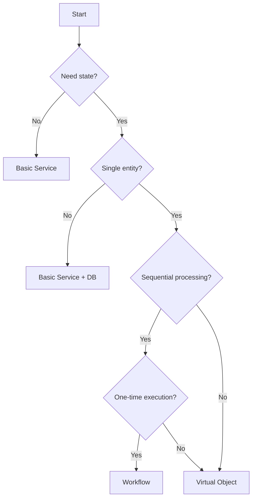

# Service Patterns & Best Practices Guide

## Overview

This guide provides comprehensive patterns for choosing and implementing Restate service types, including Virtual Object key management, rate limiting, and advanced use cases like AI agent session management.

## Part 1: Service Lifecycle Decision Framework

### When to Use Each Service Type



### Decision Matrix

| Feature | Basic Service | Virtual Object | Workflow |
|---------|--------------|----------------|----------|
| **State** | ❌ Stateless | ✅ Stateful (per-key) | ✅ Stateful (per-instance) |
| **Concurrency** | ✅ High | ⚠️ Sequential per key | ❌ Single instance |
| **Use Case** | Request/response | Entity management | Process orchestration |
| **Durability** | Only journal | State + journal | State + journal |
| **Shared Handlers** | ❌ No | ✅ Yes (concurrent reads) | ✅ Yes (status queries) |
| **Example** | Currency conversion | User account | Order processing |

---

## Part 2: Virtual Object Key Management

### Key Design Principles

**1. Keys Should Be:**
- **Deterministic** - Same inputs = same key
- **Stable** - Never change for same entity
- **Partition-friendly** - Distribute load evenly
- **Business-meaningful** - Easy to understand

### Key Generation Patterns

#### Pattern 1: Simple Entity ID

```go
// Good for single-tenant systems
type UserAccount struct{}

func (UserAccount) UpdateProfile(
    ctx restate.ObjectContext,
    profile UserProfile,
) error {
    // Key is the user ID
    userID := restate.Key(ctx)
    
    // State is isolated per user
    currentProfile, _ := restate.Get[UserProfile](ctx, "profile")
    
    // Update profile
    restate.Set(ctx, "profile", profile)
    
    return nil
}

// Usage
client := ObjectClient[UserProfile, error]{
    ServiceName: "UserAccount",
    HandlerName: "UpdateProfile",
}
err := client.Call(ctx, "user-123", profile) // Key: "user-123"
```

#### Pattern 2: Composite Key (Tenant + Entity)

```go
// Good for multi-tenant systems
type TenantResource struct{}

// Key: "tenant-abc:resource-xyz"
func GenerateResourceKey(tenantID, resourceID string) string {
    return fmt.Sprintf("%s:%s", tenantID, resourceID)
}

func (TenantResource) Allocate(
    ctx restate.ObjectContext,
    allocation Allocation,
) error {
    key := restate.Key(ctx) // "tenant-abc:resource-xyz"
    
    // Parse key if needed
    parts := strings.Split(key, ":")
    tenantID := parts[0]
    resourceID := parts[1]
    
    // Process allocation
    return processAllocation(ctx, tenantID, resourceID, allocation)
}

// Usage
key := GenerateResourceKey("tenant-abc", "resource-xyz")
client.Call(ctx, key, allocation)
```

#### Pattern 3: Hierarchical Key

```go
// Key: "org/team/project/resource"
func GenerateHierarchicalKey(components ...string) string {
    return strings.Join(components, "/")
}

// Example: "acme-corp/eng/backend/api-gateway"
key := GenerateHierarchicalKey("acme-corp", "eng", "backend", "api-gateway")
```

#### Pattern 4: Hash-Based Key (Large Keys)

```go
// When business key is too long
func GenerateHashKey(longBusinessKey string) string {
    hash := sha256.Sum256([]byte(longBusinessKey))
    return hex.EncodeToString(hash[:])
}

// Store original key in state for reference
func (MyObject) Initialize(ctx restate.ObjectContext, originalKey string) error {
    restate.Set(ctx, "original_key", originalKey)
    return nil
}
```

### Key Validation

```go
// Validate key format
func ValidateObjectKey(key string) error {
    if key == "" {
        return errors.New("key cannot be empty")
    }
    
    if len(key) > 256 {
        return errors.New("key too long (max 256 chars)")
    }
    
    // Check for invalid characters
    if strings.ContainsAny(key, "\n\r\t") {
        return errors.New("key contains invalid characters")
    }
    
    return nil
}

// Use in handlers
func (MyObject) DoWork(ctx restate.ObjectContext, req Request) error {
    key := restate.Key(ctx)
    
    if err := ValidateObjectKey(key); err != nil {
        return restate.TerminalError(err, 400)
    }
    
    // Process request
    return nil
}
```

### Concurrent Readers Pattern

Virtual Objects support **shared handlers** for concurrent read access:

```go
type BankAccount struct{}

// Exclusive handler (sequential per account)
func (BankAccount) Debit(
    ctx restate.ObjectContext,
    amount float64,
) error {
    balance, _ := restate.Get[float64](ctx, "balance")
    
    if balance < amount {
        return restate.TerminalError(errors.New("insufficient funds"), 400)
    }
    
    restate.Set(ctx, "balance", balance-amount)
    return nil
}

// Shared handler (concurrent reads!)
func (BankAccount) GetBalance(
    ctx restate.ObjectSharedContext,
) (float64, error) {
    balance, err := restate.Get[float64](ctx, "balance")
    if err != nil {
        return 0.0, err
    }
    
    return balance, nil
}

// Usage
accountClient := ObjectClient[float64, error]{
    ServiceName: "BankAccount",
    HandlerName: "Debit",
}
accountClient.Call(ctx, "account-123", 100.0) // Sequential

// Concurrent reads don't block each other
balanceClient := ObjectClient[restate.Void, float64]{
    ServiceName: "BankAccount",
    HandlerName: "GetBalance",
}
balance1, _ := balanceClient.Call(ctx, "account-123", restate.Void{})
balance2, _ := balanceClient.Call(ctx, "account-123", restate.Void{})
// Both can execute concurrently!
```

---

## Part 3: Rate Limiting with Virtual Objects

Virtual Objects provide natural per-entity rate limiting through state isolation.

### Pattern: Token Bucket Rate Limiter

```go
type RateLimiter struct{}

type TokenBucket struct {
    Tokens        float64   `json:"tokens"`
    Capacity      float64   `json:"capacity"`
    RefillRate    float64   `json:"refill_rate"`    // Tokens per second
    LastRefillAt  time.Time `json:"last_refill_at"`
}

// Initialize rate limiter for a key
func (RateLimiter) Initialize(
    ctx restate.ObjectContext,
    config RateLimiterConfig,
) error {
    bucket := TokenBucket{
        Tokens:       config.Capacity,
        Capacity:     config.Capacity,
        RefillRate:   config.RefillRate,
        LastRefillAt: time.Now(),
    }
    
    restate.Set(ctx, "bucket", bucket)
    return nil
}

// Check if request is allowed
func (RateLimiter) CheckLimit(
    ctx restate.ObjectContext,
    tokens float64,
) (RateLimitResult, error) {
    // Capture current time deterministically
    var now time.Time
    restate.Run(ctx, func(rc restate.RunContext) (restate.Void, error) {
        now = time.Now()
        return restate.Void{}, nil
    })
    
    // Get current bucket state
    bucket, err := restate.Get[TokenBucket](ctx, "bucket")
    if err != nil {
        return RateLimitResult{Allowed: false}, err
    }
    
    // Refill tokens based on elapsed time
    elapsed := now.Sub(bucket.LastRefillAt).Seconds()
    refill := elapsed * bucket.RefillRate
    bucket.Tokens = math.Min(bucket.Capacity, bucket.Tokens+refill)
    bucket.LastRefillAt = now
    
    // Check if enough tokens available
    if bucket.Tokens >= tokens {
        bucket.Tokens -= tokens
        restate.Set(ctx, "bucket", bucket)
        
        return RateLimitResult{
            Allowed:        true,
            RemainingTokens: bucket.Tokens,
        }, nil
    }
    
    // Rate limited
    restate.Set(ctx, "bucket", bucket)
    
    waitTime := (tokens - bucket.Tokens) / bucket.RefillRate
    
    return RateLimitResult{
        Allowed:         false,
        RemainingTokens: bucket.Tokens,
        RetryAfter:      time.Duration(waitTime * float64(time.Second)),
    }, nil
}

// Shared handler for checking status (doesn't consume tokens)
func (RateLimiter) GetStatus(
    ctx restate.ObjectSharedContext,
) (TokenBucket, error) {
    return restate.Get[TokenBucket](ctx, "bucket")
}

type RateLimitResult struct {
    Allowed         bool
    RemainingTokens float64
    RetryAfter      time.Duration
}
```

### Usage: API Rate Limiting

```go
type APIGateway struct{}

func (APIGateway) HandleRequest(
    ctx restate.Context,
    req APIRequest,
) (APIResponse, error) {
    // Generate rate limit key (per user or per IP)
    rateLimitKey := fmt.Sprintf("user:%s", req.UserID)
    
    // Check rate limit
    limiter := ObjectClient[float64, RateLimitResult]{
        ServiceName: "RateLimiter",
        HandlerName: "CheckLimit",
    }
    
    result, err := limiter.Call(ctx, rateLimitKey, 1.0) // Request 1 token
    if err != nil {
        return APIResponse{}, err
    }
    
    if !result.Allowed {
        return APIResponse{
            StatusCode: 429,
            Headers: map[string]string{
                "Retry-After": fmt.Sprintf("%.0f", result.RetryAfter.Seconds()),
            },
            Body: "Rate limit exceeded",
        }, nil
    }
    
    // Process request
    return processAPIRequest(ctx, req)
}
```

### Advanced: Sliding Window Rate Limiter

```go
type SlidingWindowLimiter struct{}

type RequestLog struct {
    Timestamps []time.Time `json:"timestamps"`
    WindowSize time.Duration `json:"window_size"`
    MaxRequests int `json:"max_requests"`
}

func (SlidingWindowLimiter) CheckLimit(
    ctx restate.ObjectContext,
    _ restate.Void,
) (bool, error) {
    // Get current time
    var now time.Time
    restate.Run(ctx, func(rc restate.RunContext) (restate.Void, error) {
        now = time.Now()
        return restate.Void{}, nil
    })
    
    // Get request log
    log, err := restate.Get[RequestLog](ctx, "log")
    if err != nil {
        // Initialize
        log = RequestLog{
            Timestamps:  []time.Time{},
            WindowSize:  time.Minute,
            MaxRequests: 100,
        }
    }
    
    // Remove timestamps outside window
    cutoff := now.Add(-log.WindowSize)
    validTimestamps := []time.Time{}
    for _, ts := range log.Timestamps {
        if ts.After(cutoff) {
            validTimestamps = append(validTimestamps, ts)
        }
    }
    
    // Check limit
    if len(validTimestamps) >= log.MaxRequests {
        return false, nil
    }
    
    // Add current request
    validTimestamps = append(validTimestamps, now)
    log.Timestamps = validTimestamps
    
    restate.Set(ctx, "log", log)
    return true, nil
}
```

---

## Part 4: AI Agent Session Management

Virtual Objects are perfect for managing stateful AI agent sessions.

### Pattern: Conversational AI Agent

```go
type AIAgent struct{}

type Conversation struct {
    Messages      []Message    `json:"messages"`
    Context       string       `json:"context"`
    Model         string       `json:"model"`
    MaxTokens     int          `json:"max_tokens"`
    TotalTokens   int          `json:"total_tokens"`
    CreatedAt     time.Time    `json:"created_at"`
    LastMessageAt time.Time    `json:"last_message_at"`
}

type Message struct {
    Role      string    `json:"role"`      // "user" or "assistant"
    Content   string    `json:"content"`
    Timestamp time.Time `json:"timestamp"`
    Tokens    int       `json:"tokens"`
}

// Initialize new agent session
func (AIAgent) StartSession(
    ctx restate.ObjectContext,
    config AgentConfig,
) error {
    sessionID := restate.Key(ctx)
    
    var now time.Time
    restate.Run(ctx, func(rc restate.RunContext) (restate.Void, error) {
        now = time.Now()
        return restate.Void{}, nil
    })
    
    conversation := Conversation{
        Messages:      []Message{},
        Context:       config.SystemPrompt,
        Model:         config.Model,
        MaxTokens:     config.MaxTokens,
        TotalTokens:   0,
        CreatedAt:     now,
        LastMessageAt: now,
    }
    
    restate.Set(ctx, "conversation", conversation)
    
    ctx.Log().Info("AI session started",
        "session_id", sessionID,
        "model", config.Model)
    
    return nil
}

// Send message and get response
func (AIAgent) SendMessage(
    ctx restate.ObjectContext,
    userMessage string,
) (AgentResponse, error) {
    // Get conversation state
    conv, err := restate.Get[Conversation](ctx, "conversation")
    if err != nil {
        return AgentResponse{}, errors.New("session not initialized")
    }
    
    // Capture current time
    var now time.Time
    restate.Run(ctx, func(rc restate.RunContext) (restate.Void, error) {
        now = time.Now()
        return restate.Void{}, nil
    })
    
    // Add user message
    userMsg := Message{
        Role:      "user",
        Content:   userMessage,
        Timestamp: now,
        Tokens:    estimateTokens(userMessage),
    }
    conv.Messages = append(conv.Messages, userMsg)
    conv.TotalTokens += userMsg.Tokens
    
    // Manage context window (keep last N messages)
    conv.Messages = manageContextWindow(conv.Messages, conv.MaxTokens)
    
    // Call AI model (durable side effect)
    aiResponse, err := restate.Run(ctx, func(rc restate.RunContext) (string, error) {
        return callAIModel(conv.Messages, conv.Model)
    })
    
    if err != nil {
        return AgentResponse{}, fmt.Errorf("AI model error: %w", err)
    }
    
    // Add assistant message
    assistantMsg := Message{
        Role:      "assistant",
        Content:   aiResponse,
        Timestamp: now,
        Tokens:    estimateTokens(aiResponse),
    }
    conv.Messages = append(conv.Messages, assistantMsg)
    conv.TotalTokens += assistantMsg.Tokens
    conv.LastMessageAt = now
    
    // Save updated conversation
    restate.Set(ctx, "conversation", conv)
    
    return AgentResponse{
        Message:      aiResponse,
        TotalTokens:  conv.TotalTokens,
        MessageCount: len(conv.Messages),
    }, nil
}

// Get conversation history (concurrent access via shared handler)
func (AIAgent) GetHistory(
    ctx restate.ObjectSharedContext,
) (Conversation, error) {
    return restate.Get[Conversation](ctx, "conversation")
}

// Clear old messages (context window management)
func manageContextWindow(messages []Message, maxTokens int) []Message {
    totalTokens := 0
    for i := len(messages) - 1; i >= 0; i-- {
        totalTokens += messages[i].Tokens
        if totalTokens > maxTokens {
            // Keep only recent messages
            return messages[i+1:]
        }
    }
    return messages
}

// Helper: estimate tokens (simple heuristic)
func estimateTokens(text string) int {
    return len(strings.Fields(text)) * 2 // Rough estimate
}
```

### Usage: Multi-Turn Conversation

```go
type ChatApp struct{}

func (ChatApp) Chat(
    ctx restate.Context,
    req ChatRequest,
) (ChatResponse, error) {
    // Each user gets their own AI agent instance
    sessionKey := fmt.Sprintf("user:%s", req.UserID)
    
    agent := ObjectClient[string, AgentResponse]{
        ServiceName: "AIAgent",
        HandlerName: "SendMessage",
    }
    
    // Send message and get response
    response, err := agent.Call(ctx, sessionKey, req.Message)
    if err != nil {
        return ChatResponse{}, err
    }
    
    return ChatResponse{
        Reply:        response.Message,
        TotalTokens:  response.TotalTokens,
        MessageCount: response.MessageCount,
    }, nil
}
```

### Advanced: Agent with Tool Calling

```go
type AgentWithTools struct{}

type ToolCall struct {
    Name      string         `json:"name"`
    Arguments map[string]any `json:"arguments"`
}

func (AgentWithTools) SendMessage(
    ctx restate.ObjectContext,
    message string,
) (AgentResponse, error) {
    // Get conversation
    conv, _ := restate.Get[Conversation](ctx, "conversation")
    
    // Call AI model
    aiResponse, toolCalls, err := callAIWithTools(ctx, conv, message)
    if err != nil {
        return AgentResponse{}, err
    }
    
    // Execute tool calls if any
    if len(toolCalls) > 0 {
        for _, tool := range toolCalls {
            result, err := executeTool(ctx, tool)
            if err != nil {
                return AgentResponse{}, err
            }
            
            // Add tool result to conversation
            conv.Messages = append(conv.Messages, Message{
                Role:    "tool",
                Content: result,
            })
        }
        
        // Call AI again with tool results
        aiResponse, _, err = callAIWithTools(ctx, conv, "")
        if err != nil {
            return AgentResponse{}, err
        }
    }
    
    // Save conversation
    restate.Set(ctx, "conversation", conv)
    
    return AgentResponse{Message: aiResponse}, nil
}

func executeTool(ctx restate.ObjectContext, tool ToolCall) (string, error) {
    // Execute tool as durable side effect
    return restate.Run(ctx, func(rc restate.RunContext) (string, error) {
        switch tool.Name {
        case "get_weather":
            return callWeatherAPI(tool.Arguments["location"].(string))
        case "search_database":
            return searchDatabase(tool.Arguments["query"].(string))
        default:
            return "", fmt.Errorf("unknown tool: %s", tool.Name)
        }
    })
}
```

---

## Part 5: Service Type Migration Patterns

### Migrating from Basic Service to Virtual Object

**Scenario:** You start with a stateless service but realize you need per-entity state.

```go
// Before: Basic Service (stateless)
type UserService struct{}

func (UserService) UpdateProfile(
    ctx restate.Context,
    req UpdateProfileRequest,
) error {
    // Must hit database every time
    profile, err := fetchProfileFromDB(req.UserID)
    if err != nil {
        return err
    }
    
    profile.Name = req.Name
    profile.Email = req.Email
    
    return saveProfileToDB(profile)
}

// After: Virtual Object (stateful)
type UserAccount struct{}

func (UserAccount) UpdateProfile(
    ctx restate.ObjectContext,
    req UpdateProfileRequest,
) error {
    // userID is the key - state is isolated per user
    userID := restate.Key(ctx)
    
    // Get cached state (or fetch from DB first time)
    profile, err := restate.Get[Profile](ctx, "profile")
    if err != nil {
        // First access - load from DB
        profile, err = restate.Run(ctx, func(rc restate.RunContext) (Profile, error) {
            return fetchProfileFromDB(userID)
        })
        if err != nil {
            return err
        }
    }
    
    // Update in memory
    profile.Name = req.Name
    profile.Email = req.Email
    
    // Save to state (durable)
    restate.Set(ctx, "profile", profile)
    
    // Optionally sync to DB
    restate.Run(ctx, func(rc restate.RunContext) (restate.Void, error) {
        return restate.Void{}, saveProfileToDB(profile)
    })
    
    return nil
}
```

**Benefits:**
- ✅ Reduced database load (state cached in Restate)
- ✅ Sequential consistency per user
- ✅ Built-in retries and durability

---

## Best Practices Summary

### Virtual Object Keys

✅ **DO:**
- Use business-meaningful keys
- Keep keys under 256 characters
- Use composite keys for multi-tenancy
- Validate keys in handlers

❌ **DON'T:**
- Use random/non-deterministic keys
- Include sensitive data in keys
- Use extremely high-cardinality keys

### Rate Limiting

✅ **DO:**
- Use Virtual Objects for per-entity limits
- Store token bucket state
- Use shared handlers for status checks
- Set appropriate refill rates

❌ **DON'T:**
- Rely on external rate limiters for critical limits
- Forget to refill tokens
- Use global rate limits when per-entity is better

### AI Agents

✅ **DO:**
- Manage conversation history in state
- Trim old messages (context window)
- Use durable Run blocks for AI calls
- Track token usage

❌ **DON'T:**
- Store entire conversation history indefinitely
- Make non-deterministic AI calls
- Forget to handle tool calling failures

---

## Conclusion

This guide provides:

- ✅ **Service Type Decision Matrix** - Choose the right service type
- ✅ **Key Management Patterns** - Design effective Virtual Object keys
- ✅ **Rate Limiting Implementation** - Per-entity token bucket pattern
- ✅ **AI Agent Sessions** - Stateful conversation management
- ✅ **Migration Patterns** - Evolve from Basic Service to Virtual Object

**Use these patterns** to build robust, scalable services with proper state management, rate limiting, and advanced features like AI agent sessions.

**Grade Improvement:** Service Patterns & Virtual Object usage from **Partial → A (comprehensive guidance)**
