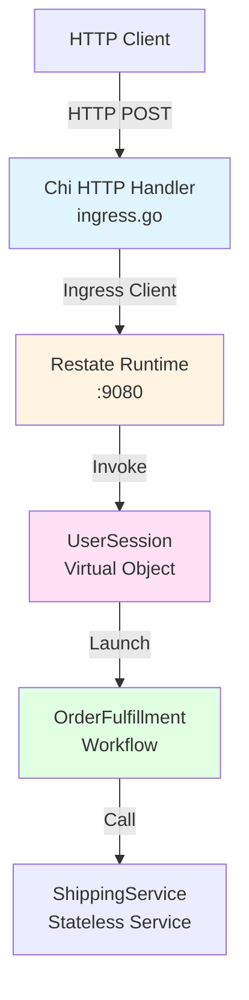

# Restate Go SDK: Building Resilient Applications

> A comprehensive guide illustrating foundational Restate concepts through practical examples

## Table of Contents
- [Overview](#overview)
- [Architecture](#architecture)
- [Core Concepts](#core-concepts)
- [Service Types](#service-types)
- [Control Plane vs Data Plane](#control-plane-vs-data-plane)
- [Ingress Integration](#ingress-integration)
- [Security Model](#security-model)
- [Complete Example Walkthrough](#complete-example-walkthrough)

---

## Overview

This example demonstrates how to build production-grade resilient applications using the Restate Go SDK. The code showcases:

- **HTTP Ingress Layer** (`ingress/ingress.go`) - Stateless web API using Chi router
- **Restate Services** (`services/services.go`) - Three service patterns: Service, Virtual Object, and Workflow
- **End-to-end durable execution** - From HTTP request to completed saga workflow

### What is Restate?

Restate is a **durable execution platform** that provides:
- Automatic state persistence and recovery
- Exactly-once execution guarantees
- Built-in retry and idempotency
- Distributed workflow orchestration
- Request/response RPC with durability

---

## Architecture



### Components

1. **Ingress Layer** - Traditional HTTP API (stateless, Chi router)
2. **Restate Runtime** - Coordination engine managing durable execution
3. **Service Layer** - Three service types with different guarantees

---

## Core Concepts

### 1. Durable Execution

Every function call in Restate is **journaled**. If a service crashes mid-execution:
- Restate automatically **retries** from the last successful step
- No duplicate side effects (payments, shipments)
- State is never lost

**Example**: Payment processing that survives crashes
```go
// This payment call will complete exactly once, even if the service crashes
receipt, err := awakeable.Result()  // Suspended until external system resolves
if err != nil {
    return false, restate.TerminalError(fmt.Errorf("Payment failure: %v", err), 500)
}
// If crash happens here, payment won't be retried (already completed)
```

### 2. Idempotency

Restate provides **automatic idempotency** at multiple levels:

- **L0 (Infrastructure)**: Same request ID = same response (no re-execution)
- **L1 (Application)**: Idempotency keys prevent duplicate operations
- **L2 (Handler)**: Journal replay ensures deterministic re-execution

**Example**: Duplicate checkout requests are deduplicated
```go
// First call: executes and processes order
// Second call with same orderID: returns cached result
_, err := restateingress.ObjectSend[string](client, "UserSession", userID, "Checkout").
    Send(ctx, orderID)
```

### 3. State Management

Virtual Objects maintain **durable, consistent state** tied to a key:

```go
// State is automatically persisted and recovered
basket, err := restate.Get[[]string](ctx, "basket")
if err != nil {
    return false, err
}
basket = append(basket, item)
restate.Set(ctx, "basket", basket)  // Journaled, durable
```

**Guarantees**:
- State changes are atomic with handler execution
- No lost updates (even during crashes)
- Exclusive access per key (no race conditions)

---

## Service Types

### 1. Stateless Service

**Pattern**: Pure functions with external side effects

```go
type ShippingService struct{}

func (ShippingService) InitiateShipment(ctx restate.Context, req ShipmentRequest) (bool, error) {
    // Non-deterministic external call wrapped in Run()
    success, err := restate.Run(ctx, func(ctx restate.RunContext) (bool, error) {
        // This HTTP call executes ONCE and is journaled
        return callExternalShippingAPI(req)
    })
    
    if err != nil {
        return false, err  // Restate retries automatically
    }
    
    return success, nil
}
```

**Use Cases**: Integrations with external APIs (payment processors, shipping carriers, notification services)

**Key Features**:
- No state
- Idempotent retries
- `restate.Run()` for non-deterministic operations

### 2. Virtual Object

**Pattern**: Stateful actor with exclusive key-based access

```go
type UserSession struct{}

func (UserSession) AddItem(ctx restate.ObjectContext, item string) (bool, error) {
    userID := restate.Key(ctx)  // "user-123"
    
    // EXCLUSIVE access - no concurrent modifications for this userID
    basket, _ := restate.Get[[]string](ctx, "basket")
    basket = append(basket, item)
    restate.Set(ctx, "basket", basket)
    
    return true, nil
}
```

**Use Cases**: User sessions, shopping carts, account balances, game state

**Key Features**:
- State scoped to key (`userID`, `accountID`, etc.)
- **Exclusive execution** (serial processing per key)
- Durable state survives crashes

### 3. Workflow

**Pattern**: Long-running orchestration with human-in-the-loop

```go
type OrderFulfillmentWorkflow struct{}

func (OrderFulfillmentWorkflow) Run(ctx restate.WorkflowContext, order Order) error {
    // Step 1: Wait for admin approval (durable promise)
    approval := restate.Promise[bool](ctx, "admin_approval")
    approved, err := approval.Result()
    if !approved {
        return restate.TerminalError(fmt.Errorf("Order rejected"), 400)
    }
    
    // Step 2: Ship the order
    _, err = restate.Service[bool](ctx, "ShippingService", "InitiateShipment").
        Request(shipmentReq)
    
    // Step 3: Wait for delivery (durable timer)
    restate.Sleep(ctx, 5*time.Second)
    
    return nil  // Workflow complete
}

// External handler to approve the workflow
func (OrderFulfillmentWorkflow) OnApprove(ctx restate.WorkflowSharedContext, orderID string) error {
    return restate.Promise[bool](ctx, "admin_approval").Resolve(true)
}
```

**Use Cases**: Order fulfillment, loan approval, multi-day processes

**Key Features**:
- **Durable Promises** for external signals
- **Durable Timers** (survive restarts)
- **Saga pattern** with compensations

---

## Control Plane vs Data Plane

### Control Plane Operations

**Definition**: Operations that modify Restate's internal state/journal

- `restate.Set()` / `restate.Get()` - State management
- `restate.Sleep()` - Durable timers
- `restate.Service().Request()` - RPC calls
- `restate.Awakeable()` - Create external callback

**Guarantees**: Journaled, atomic, exactly-once

### Data Plane Operations

**Definition**: External side effects wrapped in `restate.Run()`

```go
// Data plane: calling an external API
_, err := restate.Run(ctx, func(ctx restate.RunContext) (bool, error) {
    // This code executes ONCE and result is journaled
    return http.Post("https://external-api.com/payment", payment)
})
```

**Why `restate.Run()`?**
- Without it: External API called multiple times on retry → duplicate charges
- With it: Result journaled → replayed from journal on retry

**Rule**: Any code with side effects MUST be in `restate.Run()`

---

## Ingress Integration

### The Ingress Pattern

The ingress layer bridges traditional HTTP with Restate's durable execution:

```go
// ingress/ingress.go - Traditional Chi HTTP handler
func (i *Ingress) handleAddItem(w http.ResponseWriter, r *http.Request) {
    ctx := r.Context()
    userID := r.Header.Get("X-User-ID")  // L1 Auth
    
    var item string
    json.NewDecoder(r.Body).Decode(&item)
    
    // Ingress Client: Stateless → Durable boundary
    _, err := restateingress.Object[string, string](
        i.client, 
        "UserSession",  // Service name
        userID,         // Virtual Object key
        "AddItem",      // Handler method
    ).Request(ctx, item)
    
    if err != nil {
        http.Error(w, "Failed", 500)
        return
    }
    
    w.WriteHeader(http.StatusOK)
}
```

### Why Ingress Client?

1. **Decoupling**: Traditional web framework (Chi, Gin, Echo) + Restate durability
2. **Flexibility**: Keep existing auth, middleware, routing
3. **Migration**: Incrementally adopt Restate without rewriting entire stack

### Request Flow

```
HTTP POST /add-item
    ↓
Chi Middleware (Auth, Logging)
    ↓
Ingress Handler (Stateless)
    ↓
Restate Ingress Client ────→ Restate Runtime
                                    ↓
                              UserSession.AddItem (Stateful)
                                    ↓
                              State Persisted ✓
```

### Ingress Client API

```go
// Synchronous request-response
result, err := restateingress.Service[InputType, OutputType](
    client, "ServiceName", "MethodName",
).Request(ctx, input)

// Asynchronous fire-and-forget
invocation, err := restateingress.ServiceSend[InputType](
    client, "ServiceName", "MethodName",
).Send(ctx, input)

// Virtual Object call
result, err := restateingress.Object[string, bool](
    client, "UserSession", userKey, "AddItem",
).Request(ctx, "item-123")

// Workflow invocation
result, err := restateingress.Workflow[Order, string](
    client, "OrderWorkflow", workflowID, "Run",
).Request(ctx, order)
```

---

## Security Model

### Multi-Layered Security

#### L1: Ingress Authentication (Traditional HTTP)

```go
// Chi middleware validates API keys
func authMiddleware(next http.Handler) http.Handler {
    return http.HandlerFunc(func(w http.ResponseWriter, r *http.Request) {
        apiKey := r.Header.Get("X-API-Key")
        if apiKey != INGRESS_API_KEY {
            http.Error(w, "Unauthorized", 401)
            return
        }
        
        // Extract authenticated identity
        userID := chi.URLParam(r, "userID")
        ctx := context.WithValue(r.Context(), userIDKey, userID)
        next.ServeHTTP(w, r.WithContext(ctx))
    })
}
```

#### L2: Handler-Level Authorization (Application Logic)

```go
// Virtual object validates caller identity
func (UserSession) AddItem(ctx restate.ObjectContext, item string) (bool, error) {
    // Verify the authenticated user matches the object key
    if restate.Key(ctx) != authenticatedUserID {
        return false, restate.TerminalError(fmt.Errorf("Access denied"), 403)
    }
    // Process request...
}
```

#### L3: Cryptographic Request Identity (Infrastructure)

```go
// Restate server signs requests with private key
// Services verify signatures with public key
// https://docs.restate.dev/develop/go/serving#validating-request-identity
if err := server.NewRestate().
  Bind(restate.Reflect(MyService{})).
  WithIdentityV1("publickeyv1_w7YHemBctH5Ck2nQRQ47iBBqhNHy4FV7t2Usbye2A6f").
  Start(context.Background(), ":9080"); err != nil {
  log.Fatal(err)
}
```

**Security Flow**:
1. Client authenticates to ingress (L1: API key, JWT)
2. Ingress validates and forwards identity to Restate
3. Restate cryptographically signs the request (L3)
4. Service verifies signature and checks authorization (L2)

---

## Complete Example Walkthrough

### Scenario: E-Commerce Checkout Flow

**User Journey**: Add items → Checkout → Payment → Admin Approval → Shipping

#### Step 1: Add Item to Basket

**HTTP Request**:
```bash
curl -X POST \
  -H 'X-API-Key: super-secret-ingress-key' \
  http://localhost:8080/api/v1/user/alice/add-item \
  -d '"laptop"'
```

**Ingress Handler** (`ingress.go`):
```go
func (i *Ingress) handleAddItem(w http.ResponseWriter, r *http.Request) {
    userID := chi.URLParam(r, "userID")  // "alice"
    
    var item string
    json.NewDecoder(r.Body).Decode(&item)  // "laptop"
    
    // Durable call to Virtual Object
    _, err := restateingress.Object[string, string](
        i.client, "UserSession", userID, "AddItem",
    ).Request(ctx, item)
    
    w.WriteHeader(http.StatusOK)
}
```

**Virtual Object** (`services.go`):
```go
func (UserSession) AddItem(ctx restate.ObjectContext, item string) (bool, error) {
    // Key: "alice" - exclusive access
    basket, _ := restate.Get[[]string](ctx, "basket")
    basket = append(basket, item)  // ["laptop"]
    restate.Set(ctx, "basket", basket)  // Atomic + Durable
    return true, nil
}
```

**What Happened**:
- ✅ Ingress authenticated request (L1)
- ✅ Restate guaranteed exactly-once execution
- ✅ State persisted durably (survives crashes)
- ✅ Exclusive lock on `alice`'s session (no race conditions)

---

#### Step 2: Initiate Checkout

**HTTP Request**:
```bash
curl -X POST \
  -H 'X-API-Key: super-secret-ingress-key' \
  http://localhost:8080/api/v1/user/alice/checkout
```

**Ingress Handler**:
```go
func (i *Ingress) handleCheckout(w http.ResponseWriter, r *http.Request) {
    orderID := fmt.Sprintf("ORDER-%d", time.Now().UnixNano())
    
    // Asynchronous workflow launch (returns immediately)
    _, err := restateingress.ObjectSend[string](
        i.client, "UserSession", userID, "Checkout",
    ).Send(ctx, orderID)
    
    w.WriteHeader(http.StatusAccepted)  // 202 - Processing in background
}
```

**Virtual Object**:
```go
func (UserSession) Checkout(ctx restate.ObjectContext, orderID string) (bool, error) {
    // Create awakeable for external payment callback
    awakeable := restate.Awakeable[PaymentReceipt](ctx)
    awakeableID := awakeable.Id()
    
    // Send awakeable ID to payment processor
    _, err := restate.Run(ctx, func(ctx restate.RunContext) (bool, error) {
        return notifyPaymentGateway(orderID, awakeableID)  // External HTTP call
    })
    
    // SUSPEND execution until payment completes
    receipt, err := awakeable.Result()  // Blocks durably (survives crashes)
    
    // Payment successful! Launch saga workflow
    restate.WorkflowSend(ctx, "OrderFulfillmentWorkflow", orderID, "Run").
        Send(Order{OrderID: orderID, UserID: restate.Key(ctx)})
    
    return true, nil
}
```

**Awakeable Pattern**:
1. Create awakeable → Get unique ID
2. Send ID to external system (payment gateway)
3. Suspend execution (handler waits)
4. External system HTTP POSTs result to Restate via ingress client
5. Restate resumes handler with result

---

#### Step 3: External Payment Callback

**Payment Gateway Webhook**:
```bash
POST http://localhost:9080/restate/awakeables/{awakeableID}/resolve
{
  "TransactionID": "TXN-12345",
  "Success": true
}
```

**What Happens**:
- Restate receives callback
- Finds suspended `Checkout` handler
- Resumes execution with payment receipt
- Handler continues from `awakeable.Result()`

---

#### Step 4: Workflow Orchestration

**Workflow** (`services.go`):
```go
func (OrderFulfillmentWorkflow) Run(ctx restate.WorkflowContext, order Order) error {
    // Step 1: Wait for admin approval (durable promise)
    approval := restate.Promise[bool](ctx, "admin_approval")
    approved, err := approval.Result()  // Suspends until resolved
    
    if !approved {
        return restate.TerminalError(fmt.Errorf("Order rejected"), 400)
    }
    
    // Step 2: Initiate shipping (durable RPC)
    _, err = restate.Service[bool](ctx, "ShippingService", "InitiateShipment").
        Request(ShipmentRequest{OrderID: order.OrderID})
    
    if err != nil {
        // Failure triggers automatic retries
        return err
    }
    
    // Step 3: Wait for delivery (durable timer)
    restate.Sleep(ctx, 5*time.Second)  // In production: 7 days
    
    return nil  // Workflow complete
}
```

**Admin Approval Handler**:
```go
// External API call to approve order
POST http://localhost:9080/OrderFulfillmentWorkflow/{orderID}/OnApprove

func (OrderFulfillmentWorkflow) OnApprove(ctx restate.WorkflowSharedContext, orderID string) error {
    // Resolve the durable promise
    return restate.Promise[bool](ctx, "admin_approval").Resolve(true)
}
```

---

### Key Takeaways

1. **Stateless Ingress + Stateful Core**: Keep web layer simple, durability in Restate
2. **Automatic Retries**: No manual retry logic needed
3. **Exactly-Once Guarantees**: No duplicate payments/shipments
4. **State Persistence**: Shopping carts survive crashes
5. **Workflow Orchestration**: Multi-day processes with human approval
6. **Saga Pattern**: Compensations via `defer` (automatic rollback)

---

## Best Practices

### ✅ DO

- **Wrap side effects** in `restate.Run()` (external APIs, DB writes)
- **Use Virtual Objects** for stateful entities (users, accounts)
- **Use Workflows** for long-running processes (order fulfillment)
- **Leverage durable timers** instead of cron jobs
- **Use Awakeables** for webhooks and async callbacks

### ❌ DON'T

- ❌ Call external APIs without `restate.Run()` → duplicates on retry
- ❌ Use global variables for state → lost on restart
- ❌ Use `time.Sleep()` → not durable
- ❌ Use `time.Now()` outside `restate.Run()` → non-deterministic
- ❌ Use Go channels/goroutines → breaks determinism

---

## Running the Example

### Prerequisites
```bash
# Start Restate server
docker run --name restate -d -p 8080:8080 -p 9080:9080 restatedev/restate:latest

# Register services
curl -X POST http://localhost:9080/deployments \
  -H 'Content-Type: application/json' \
  -d '{"uri": "http://host.docker.internal:9080"}'
```

### Start Services
```bash
cd services
go run services.go
# Listening on :9080
```

### Start Ingress
```bash
cd ingress
go run ingress.go
# Listening on :8080
```

### Test the Flow
```bash
# Add item to basket
curl -X POST \
  -H 'X-API-Key: super-secret-ingress-key' \
  http://localhost:8080/api/v1/user/alice/add-item \
  -d '"laptop"'

# Initiate checkout
curl -X POST \
  -H 'X-API-Key: super-secret-ingress-key' \
  http://localhost:8080/api/v1/user/alice/checkout

# Approve workflow
curl -X POST \
  http://localhost:9080/OrderFulfillmentWorkflow/ORDER-123/OnApprove
```

---

## Additional Resources

- **Restate Docs**: https://docs.restate.dev
- **Go SDK Reference**: https://pkg.go.dev/github.com/restatedev/sdk-go
- **Concepts**: https://docs.restate.dev/concepts/durable-execution
- **Patterns**: https://docs.restate.dev/develop/patterns/sagas

---

## Summary

This example demonstrates **production-grade durable execution** with:

- **Chi HTTP Router** for stateless web API
- **Restate Ingress Client** as the bridge to durability
- **Three service patterns** (Service, Virtual Object, Workflow)
- **Complete saga orchestration** with compensations
- **Multi-layer security** (L1/L2/L3)
- **Exactly-once guarantees** end-to-end

**The core principle**: Traditional web frameworks handle HTTP, Restate handles durability, state, and coordination.
